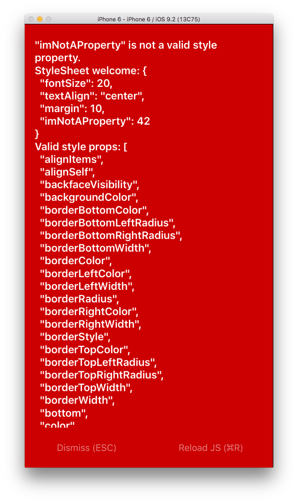

# Learn React Native :: challenge 02

[](https://facebook.github.io/react-native/)

> :coffee: This challenge is about **simulator orientation**

## <a name='TOC'>Summary</a>

01. [Objective](#objective)
02. [Setup](#setup)
02. [Pointers](#pointers)
42. [Credits](#credits)

## <a name='objective'>Objective</a>

The goal of this challenge it to become comfortable with light debugging and the basic React Native dev tools. You’ll debug some errors, and then spend some time poking around the iOS simulator.

## <a name='setup'>Setup</a>

Before you begin, replace the contents of your project’s `index.ios.js` file with the following:

```js
'use strict';
import React, {
  AppRegistry,
  Component,
  Image,
  StyleSheet,
  Text,
  View
} from 'react-native';

class FirstApp extends Component {
  render() {
    imNotDefined

    return (
      <View style={styles.container}>
        <Text style={styles.welcome}>
          Nice work!
        </Text>
        <Image
          style={styles.image}
          source={{uri: 'https://s3.amazonaws.com/vigesharing-is-vigecaring/lkurtz/rn-workshop-thumbs-up.gif'}}
        />
        <Text style={styles.instructions}>
          Now take a look around a bit with the dev tools.
        </Text>
        <Text style={styles.instructions}>
          Remember: press Cmd+R to reload,{'\n'}
          Cmd+D or shake for dev menu
        </Text>
      </View>
    );
  }
}

const styles = StyleSheet.create({
  container: {
    flex: 1,
    justifyContent: 'center',
    alignItems: 'center',
    backgroundColor: '#F5FCFF',
  },
  welcome: {
    fontSize: 20,
    textAlign: 'center',
    margin: 10,
    imNotAProperty: 42
  },
  instructions: {
    textAlign: 'center',
    color: '#333333',
    marginBottom: 10,
  },
  image: {
    height: 100,
    margin: 25,
    width: 200,
  },
});

AppRegistry.registerComponent('FirstApp', () => FirstApp);
```

Save the file, then run the simulator again.


## <a name='pointers'>Pointers</a>

### Dealing With Errors

Once you complete the setup instructions, you might be thinking "...what the heck?"



This is the exception screen. If you’re like me, you’ll come to know this screen quite well.

You’ve already noticed that the screen contains a helpful error message. It also includes a stack trace of the exception underneath the error. Since this is an iPhone simulator, you can’t scroll with a mouse wheel. Instead use your cursor as a finger. Depress the mouse button to touch your virtual finger to the screen.

Do you see where the error is coming from? The majority of stack traces will reference files in the React Native core. Let’s focus on the files we control. What file in the trace looks familiar? Track down and destroy the bug, then click “Reload JS” (or hit Cmd+R) to see if you got it.

Repeat until the file is error-free.

##### Exploring Sim Functions

In the simulator, hit Cmd+Shift+H.

Nice, you just hit the phone’s home button. Yep, the simulator is simulating an entire phone, not just your application. You can perform simulated hardware actions (like hitting the home button, locking, etc.) via the Hardware item in the Simulator’s menubar. Check them out.

##### Exploring the Dev Menu

React Native ships will a set of useful simulator dev tools. You can take a look at these tools by hitting Cmd+D in the simulator (or shaking comically hard if you’re running on an actual device). Explore around and get a sense for what each of these provides.

Two notes:
- You’ll need to install an additional dependency to view generated systraces… don’t worry about that for now.
- Chrome debugging can be really useful tool for complex debugging, but it can be pretty finicky. Your mileage may vary.

## <a name='gogogo'>Go go go</a>

Debug the app. Play with the simulator. Expore the React Native dev tools.

Then, with Live Reload enabled, change some content in the components within `index.ios.js`.

#### Next

Well, you have just finished this challenge... easy right? :wink:<br />
Go to the [challenge #04](https://github.com/majdi/learn-react-native/tree/master/challenge-04).

## <a name='credits'>Credits</a>

Write & develop with :heart: by [**Majdi Toumi**](http://majditoumi.com) | [**Mhirba**](http://www.mhirba.com).
