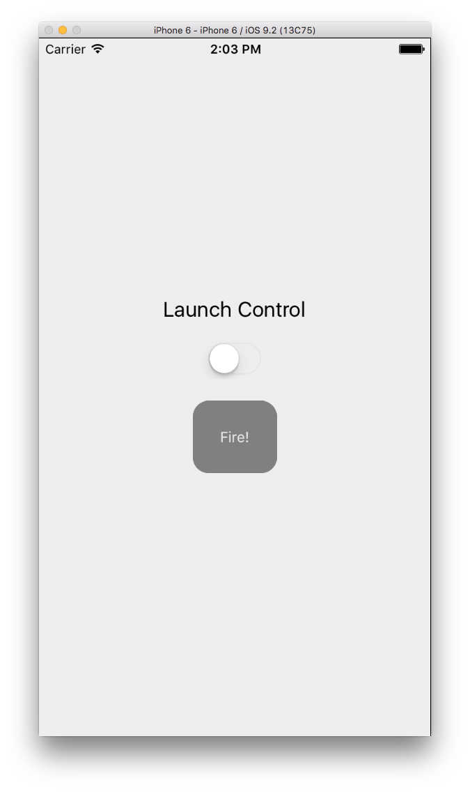
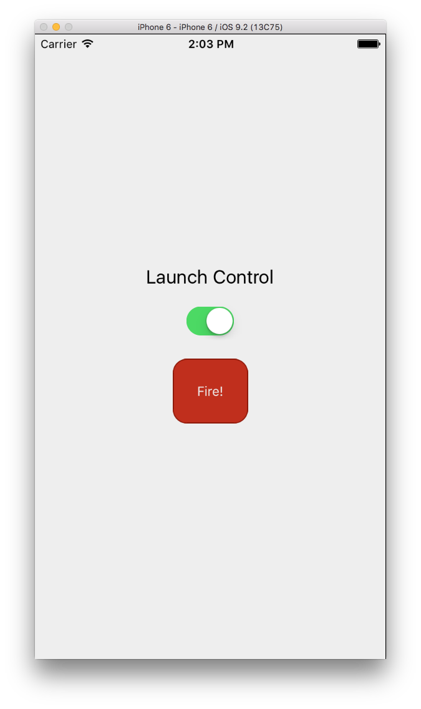

# Learn React Native :: challenge 04

[](https://facebook.github.io/react-native/)

> :coffee: This challenge is about **rockets**

## <a name='TOC'>Summary</a>

01. [Objective](#objective)
02. [Setup](#setup)
02. [Pointers](#pointers)
42. [Credits](#credits)

## <a name='objective'>Objective</a>

Stateless apps are boring. Let’s make an app that actually does something.

Make an app with a button that fires a rocket. The button should have some sort of safety to prevent accidental launches. For the purposes of this challenge, let’s not actually fire rockets though. You can show an image of a launch instead.

Below is one example of what the app could look like, but the functionality and style of your own app is completely up to you!





Find your own launch image, or use the one included in the asset directory.

## <a name='setup'>Setup</a>

Before you begin, replace the contents of your project’s `index.ios.js` file with the following:

```jsx
'use strict';
import React, {
  AppRegistry,
  Component,
  StyleSheet,
  Text,
  View
} from 'react-native';

const FirstApp = React.createClass({
  getInitialState() {
    return {
      // You may want to put stuff here.
    }
  },

  render() {
    return (
      <View style={styles.container}>
        <Text style={styles.welcome}>
          Up next...
        </Text>
        <Text style={styles.instructions}>
          Build an app to launch Spacex rockets.
        </Text>
        <Text style={styles.instructions}>
          It should include some type of launch safeguard{'\n'}
          to enable and disable a main Launch button.
        </Text>
        <Text style={styles.instructions}>
          For the purposes of this example, don't actually{'\n'}
          launch a rocket. Instead you can just show a picture{'\n'}
          of a rocket launch instead.
        </Text>
      </View>
    );
  }
})

const styles = StyleSheet.create({
  container: {
    flex: 1,
    justifyContent: 'center',
    alignItems: 'center',
    backgroundColor: '#eee',
  },
  welcome: {
    fontSize: 20,
    textAlign: 'center',
    margin: 20,
  },
  instructions: {
    marginTop: 10,
    textAlign: 'center',
  }
});

AppRegistry.registerComponent('FirstApp', () => FirstApp);
```

## <a name='pointers'>Pointers</a>

### Touchables

React Native includes component types (called Touchables) specifically designed to handle touch interactions. These include:

- [`<TouchableHighlight>`](https://facebook.github.io/react-native/docs/touchablehighlight.html#content)
- [`<TouchableOpacity>`](https://facebook.github.io/react-native/docs/touchableopacity.html#content)
- [`<TouchableWithoutFeedback>`](https://facebook.github.io/react-native/docs/touchablewithoutfeedback.html#content)

Touchables accept the following props as interaction event handlers by default:

- `onLongPress`
- `onPress`
- `onPressIn`
- `onPressOut`

##### Native Elements

React Native includes many component types that are simple wrappers around native UI elements. One example of such is [`<Switch>`](https://facebook.github.io/react-native/docs/switch.html#content). It is often a good idea to use as many native elements as possible to keep your interface familiar and performant. (It’s also just easier to use these great components out of the box than to build your own versions of the same thing.) The official documentation is the best place for information about how to use each of these components.

## <a name='gogogo'>Go go go!</a>

Make an app. Launch the rockets. Be a hero!

## <a name='next'>Next</a>

Well, you have just finished this challenge... easy right? :wink:<br />
Post a screenshot of your app in the `#progress` channel, then move on to the [challenge #04](https://github.com/majdi/learn-react-native/tree/master/challenge-05).

## <a name='credits'>Credits</a>

Write & develop with :heart: by [**Majdi Toumi**](http://majditoumi.com) | [**Mhirba**](http://www.mhirba.com).
