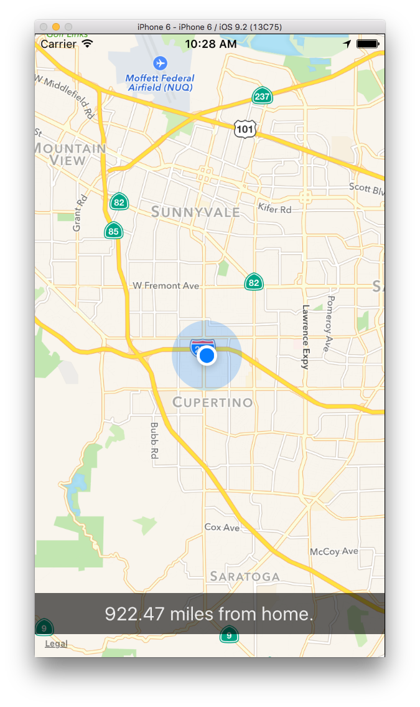

# Learn React Native :: challenge 05

[](https://facebook.github.io/react-native/)

> :coffee: This challenge is about **miles from home**.

## <a name='TOC'>Summary</a>

01. [Objective](#objective)
02. [Setup](#setup)
02. [Pointers](#pointers)
42. [Credits](#credits)

## <a name='objective'>Objective</a>

Access to accurate and timely location information is a distinguishing feature of native applications. In this challenge, we’ll explore the Geolocation API exposed by React Native.

Build an app that shows your location on a map (updating in real-time), and how many miles away from your hometown you are.
Here’s an example of what that could look like:



## <a name='setup'>Setup</a>

Before you begin, replace the contents of your project’s `index.ios.js` file with the following:

```jsx
'use strict';
import React, {
  AppRegistry,
  StyleSheet,
  Text,
  View
} from 'react-native';

function distance(lat1, lon1, lat2, lon2) {
    var radlat1 = Math.PI * lat1/180
    var radlat2 = Math.PI * lat2/180
    var theta = lon1-lon2
    var radtheta = Math.PI * theta/180
    var dist = Math.sin(radlat1) * Math.sin(radlat2) + Math.cos(radlat1) * Math.cos(radlat2) * Math.cos(radtheta);
    dist = Math.acos(dist)
    dist = dist * 180/Math.PI
    dist = dist * 60 * 1.1515
    return dist.toFixed(2)
}

const FirstApp = React.createClass({
  getInitialState() {
    return {
      position: {
        coords: {
          latitude: 0,
          longitude: 0
        }
      }
    }
  },


  distanceFromHome() {
    // These are the coords for Boulder, CO, USA.
    // Replace with your own hometown coords!
    const homePosition = {
      latitude: 40.0274,
      longitude: -105.2519
    }

    const currentPosition = this.state.position.coords

    return distance(homePosition.latitude, homePosition.longitude, currentPosition.latitude, currentPosition.longitude)
  },

  render() {
    return (
      <View style={styles.container}>
        <Text style={styles.welcome}>
          Geolocation is cool.
        </Text>
        <Text style={styles.instructions}>
          Make an app that shows this device's location{'\n'}
          on a map, and displays in realtime its{'\n'}
          distance from your home city.
        </Text>
        <Text style={styles.instructions}>
          Feel free to use the provided `distanceFromHome`{'\n'}
          method, but note that it expects `this.state.position`{'\n'}
          to be a position object from the Geolocation API.
        </Text>
      </View>
    );
  }
})

const styles = StyleSheet.create({
  container: {
    flex: 1,
    justifyContent: 'center',
    alignItems: 'center',
    backgroundColor: '#F5FCFF',
  },
  welcome: {
    fontSize: 20,
    textAlign: 'center',
    margin: 10,
  },
  instructions: {
    textAlign: 'center',
    color: '#333333',
    marginBottom: 10,
  },
});

AppRegistry.registerComponent('FirstApp', () => FirstApp);
```

## <a name='pointers'>Pointers</a>

### Distance Calculation

Feel free to use the provided `distanceFromHome` method, but note that this method expects a data structure similar to that of the initial state for `position`.

Also don’t forget to update the latitude and longitude in `distanceFromHome`!

##### MapView

[`<MapView>`](https://facebook.github.io/react-native/docs/mapview.html#content) is ReactNative’s component wrapper for native maps. Some useful props available to `<MapView>` are `showUserLocation`, `region`, and `scrollEnabled`, but see [the docs](https://facebook.github.io/react-native/docs/mapview.html#props) for all the juicy details.


##### Geolocation Polyfill

In addition to location-oriented components like `<MapView>`, React Native provides a [Geolocation API](https://facebook.github.io/react-native/docs/geolocation.html#content) to the spec of [Mozilla Web API](https://developer.mozilla.org/en-US/docs/Web/API/Geolocation).

This API lets you do perform more advanced, non-map based activity based on location.
Using this API, you can get a user’s current position (`getCurrentPosition`), subscribe to updates of the user’s position (`watchPosition`), and clear the aforementioned subscription (`clearWatch`).

A simple example:

```jsx
// ...

componentDidMount() {
  const positionOptions = {
    enableHighAccuracy: true,
    timeout: 10000,
    maximumAge: 1000
  }

  const onSuccess = (position) => {
    // on successful retrieval of a position, this function will execute
    this.setState({ position })
  }

  const onFailure = (error) => {
    // on a failed attempt to get a position, this function will execute
    alert(error)
  }

  navigator.geolocation.getCurrentPosition(onSuccess, onFailure, positionOptions)
}

// ...
```

Hit [the docs](https://facebook.github.io/react-native/docs/geolocation.html#content) for more details, and examples of the API in use.

##### Location Simulation

By default, the iOS Simulator won’t provide a location to your app. To change this, click the “Debug” item in the Simulator menubar, hover over “Location” at the bottom, and select “Freeway Drive”. This sets up the simulator to simulate the location of somebody cruising the freeway through the bay area. (You might need to stop the Simulator and rebuild your app for this setting to take effect.)

### Semi-Transparent Backgrounds

Semi-transparent colors in React Native work the same as in CSS. To set such a color, you can do:

```jsx
{
  page: {
    backgroundColor: 'rgba(0,0,0,0.5)',
  }
}
```

## <a name='gogogo'>Go go go!</a>

Make the app. When you’re done move on to [challenge #06](https://github.com/majdi/learn-react-native/tree/master/challenge-06) :wink:

## <a name='credits'>Credits</a>

Write & develop with :heart: by [**Majdi Toumi**](http://majditoumi.com) | [**Mhirba**](http://www.mhirba.com).
